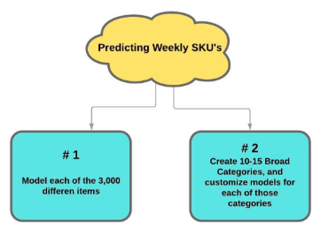
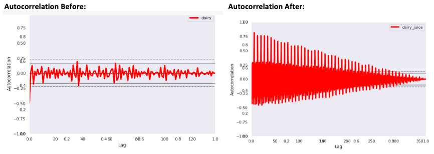
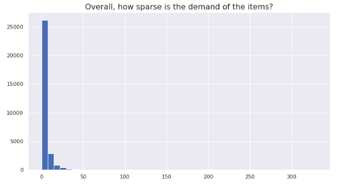
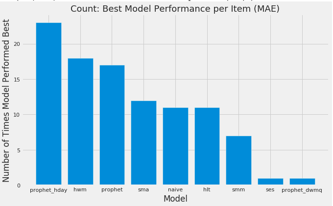
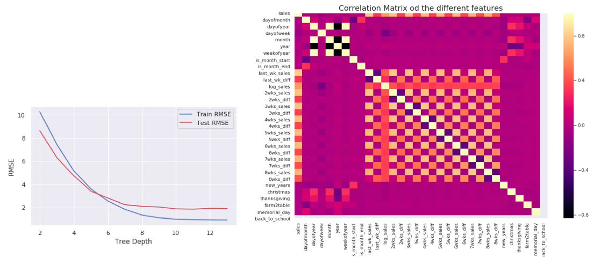
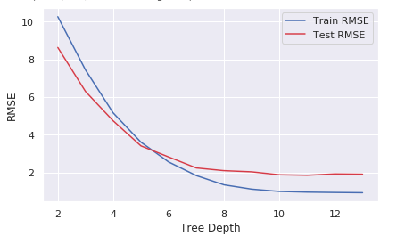
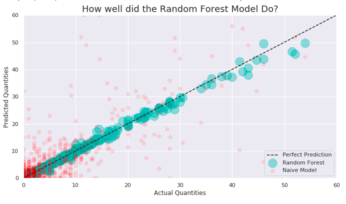

# Forecasting Weekly Demand for Individual Grocery Items

A local food distribution company buys produce from local farms and then distributes to wholesalers, upscale restaurants, grocery stores, and individuals. This company habitually over and under stocks their goods because they do not have an inventory demand forecast model. Buying decisions are mainly made by gut or innate industry knowledge. There is currently no systematic, data-driven stocking approach in place.

***The aim of this study will be to create a useful predictive model to forecast the demands for each individual item’s PLU number. This represents a huge potential savings for the customer.***

## 1. APPROACH

**There are two ways this type of problem can be approached:**
I experimented with both ways, but ultimately the hierarchical model was not generalizing well when it was deployed on the individual level, and I wasn't getting very accurate results. Thus, the winner was using a model for each of the items.

## 2. EDA
[EDA Notebooks](https://github.com/Colley-K/Time_series_forecasting/tree/master/2.%20EDA)

**PROBLEM 1:** The further back you modelled, the less it represented the trend and seasonality of the current year.
>
>**WHY?**
>
>With this size of a buisness, there was a LOT of outside influences that were making it impossible to have a consistent yearly trend.
>
>**Solution**
>
>Use the past year of data for the most accurate way model the future
>

**PROBLEM 2:** The data was representing complete random walk processess with zero correlation to the past. 
>
>**Solution**
>
>Try aggregating the data by daily, weekly, bi-monthly, monthly with historic data going back 2.5 years, 2 years, 1.5 year, 1 year and try all of these combinations with stationary data and non-stationary data.
>
>**WINNER**
>
>The combination with the best signal was a year of past data aggregated daily or weekly.
>

>
**Problem 3:** The PLU codes were very granular. Thus, the data was really sparse with most items having around a zero demand per week.
>
>**Solution**
>
>Try using a model that can handle a lot of sparsity.
>

## 3. Models
[Model Notebooks](https://github.com/Colley-K/Time_series_forecasting/tree/master/4.%20Models)

1. Naive Model
2. Classical Models (SMA, SES, HLT, HWM)
3. Prophet (Facebook)
4. Random Forest Regression
5. Light Gradient Boost model

#### Results:
*Between the classical models and Prophet, Prophet with holidays and customized trends did the best. However, the naive model (the client's current model) was still winning around 11% of the time. Overall, these models were improving upon the existing model by 43%-50%, but it was not good that the naive model was still beating it 11% of the time. Next, I tried the tree based models, and they increased the accuracy by 60%-88%. This is because random forests and light gradient boost models are better at handling sparse datasets. However, the LGBM model was definitely overfitting, and no matter how I tried hyper tuning the parameters I was not able to completely fix this. After researching, I found out overfitting is a common problem when using a LGB model with a smaller dataset, and they really do best with large data.*

## 4. WINNER: Random Forest Regression
[RFR Notebooks](https://github.com/Colley-K/Time_series_forecasting/tree/master/Random_Forest_Code)

**Overview:** Although the RFR is not as fast and efficient as the LGB model, I was able to successfully tune the overfitting issue with the RFR. Depending on the week, it's beating the clients current naive model by 60%-88% with an average error of around 5 units (compared to their current average error of 14 units per item/per week).

**Problem:** Tree based models are inherently not capable of predicting increases in future trends.
>
>**Solution**
>
>I take the log of the data before I model it, and then convert it back after making the predictions. This should help make the data a little more stationary which will help predict trends in the future.
>

**Feature Engineering:** Created 30 different columns based on time, holidays, and past/differenced sales

**Hypertuning Parameters:** Found the optimal max trees and tree depth to account for overfitting.

## 5. CONCLUSION
With a random forest regression, I was able to make timely and accurate forecasts for 3000 different invidual grocery items on a weekly basis.

**Random Forest Accuracy:**

