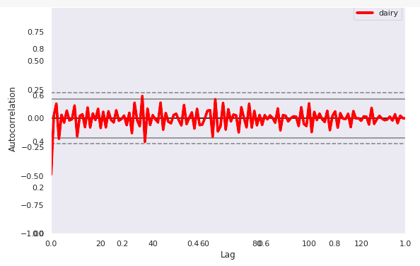
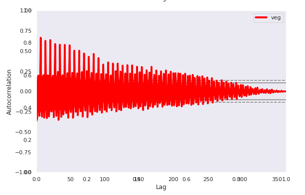
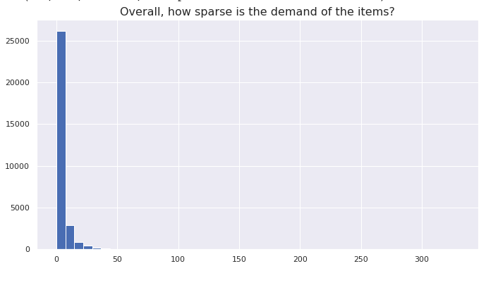

# Forecasting Weekly Demand for Individual Grocery Items

A local food distribution company buys produce from local farms and then distributes to wholesalers, upscale restaurants, grocery stores, and individuals. This company habitually over and under stocks their goods because they do not have an inventory demand forecast model. Buying decisions are mainly made by gut or innate industry knowledge. There is currently no systematic, data-driven stocking approach in place.

***The aim of this study will be to create a useful predictive model to forecast the demands for each individual item’s PLU number. This represents a huge potential savings for the customer.***

## 1. APPROACH

**There are two ways this type of problem can be approached:**
I experimented with both ways, but ultimately the hierarchical model was not generalizing well when it was deployed on the individual level, and I wasn't getting very accurate results. Thus, the winner was using a model for each of the items.

## 2. EDA
[EDA Notebooks](https://github.com/Colley-K/Time_series_forecasting/tree/master/2.%20EDA)

#### Bumps in the Road:
**PROBLEM 1:** The further back you modelled, the less it represented the trend and seasonality of the current year.
>
>**WHY?**
>
>With this size of a buisness, there was a LOT of outside influences that were making it impossible to have a consistent yearly trend.
>
>**Solution**
>
>Use the past year of data for the most accurate way model the future
>

**PROBLEM 2:** The data was representing complete random walk processess with zero correlation to the past. 
>
>**Solution**
>
>Try aggregating the data by daily, weekly, bi-monthly, monthly with historic data going back 2.5 years, 2 years, 1.5 year, 1 year and try all of these combinations with stationary data and non-stationary data.
>
>**WINNER**
>
>The combination with the best signal was a year of past data aggregated daily or weekly.
>
**Autocorrelation Before:**
>

>
**Autocorrelation After:**
>

>
**Problem 3:** The PLU codes were very granular. Thus, the data was really sparse with most items having around a zero demand per week.
>
>**Solution**
>
>Try using a model that can handle a lot of sparsity.
>

