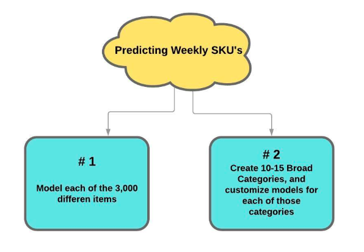
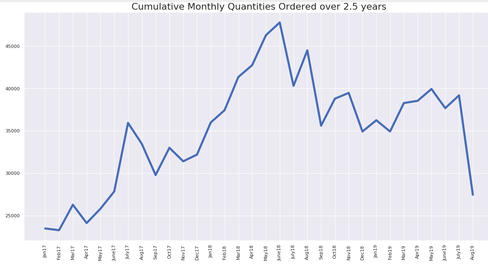

# Forecasting Weekly Demand for Individual Grocery Items

A local food distribution company buys produce from local farms and then distributes to wholesalers, upscale restaurants, grocery stores, and individuals. This company habitually over and under stocks their goods because they do not have an inventory demand forecast model. Buying decisions are mainly made by gut or innate industry knowledge. There is currently no systematic, data-driven stocking approach in place.

***The aim of this study will be to create a useful predictive model to forecast the demands for each individual item’s PLU number. This represents a huge potential savings for the customer.***

## APPROACH

There are two ways this type of problem can be approached:

## EDA

#### Findings
I started with modelling 2.5 years of data because my thought was

